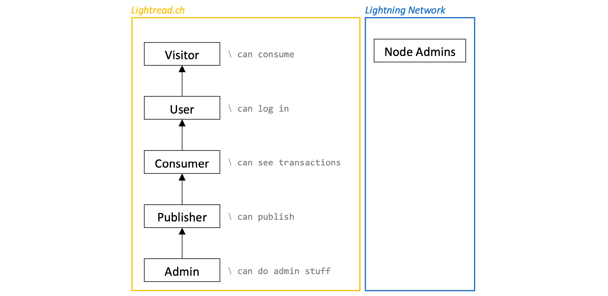

# Requirements
{: .no_toc }

## Table of contents
{: .no_toc .text-delta }

1. TOC
{:toc}

---

## Actors
The following diagram shows the actors conceptually. Important to notice is, that the Node Admins represent actors of the Lightning Network which is outside of lightread's system boundaries. Furthermore, no class-based distinction is made between Consumer, Publisher, or Admin. Since they are all stored in the same database table, they are also represented by the same class called Users.

### 0 User
Someone who signed up on the platform and hence has an account. An User becomes a Publisher after successful verification by indicating a valid email address. Unverified Users are deemed as Consumers. Some special Users are deemed as Admins. Platform visitors who do not login are deemed as Visitors.
### 1 Consumer
A Consumer is an unverified User that only can consume content on the platform but is not allowed to publish any content so far. Consequently, Consumers are not able to earn Satoshis. Once they become verified, they become a Publisher and hence may start earning Satoshis. Synonym for Consumer is Reader.
### 2 Publisher
A Publisher is a verified user that can consume and publish content on the platform. Consequently, Publishers are able to earn Satoshis. Consumer specific requirements are also applicable to Publisher. Synonym for Publisher is Author.
### 3 Admins
An Admin is a verified User that is able to see insights about the platform's activities and the platform's Lightning nodes. They are also administrators of the platform's Lightning node.
### 4 Node Admins
Node Admins represent other Lightning node administrators (or Lightning network participants) who are interested in opening channels with our platform's Lightning node.

## Individual Requirements
The following lists show the requirement of this web project, grouped using the [MoSCoW method](https://en.wikipedia.org/wiki/MoSCoW_method). The check box indicates whether a requirement is fulfilled in the running version or not.
### Must-haves
- [x] Visitors must be able to become an User by creating an account.
- [x] Users must be able to search for articles.
- [x] Users must be able to verify their account by indicating a valid email address in order to become Publisher.
- [x] Publishers must be able to write content using a markdown editor.
- [x] Publishers must be able to associate an article with a category.
- [x] Publishers must have the option to offer their content for free (free content).
- [x] Publishers must be able to restrict the access to the full content until the consumer paid a predefined fee for it (paid content).
- [x] Publisher must be able to self-define the access fee of their content in amount of Satoshis.
- [x] Visitors and Users must be able to read free content.
- [x] Visitors and Users must be able to read paid content after the corresponding fee is paid via the Lightning Network.
- [x] Users must be able to re-access already paid content without paying again.
- [x] Publishers must be able to withdraw a specific amount their generated revenue in Satoshis to their own-controlled Lightning wallet.
- [x] Publishers must be able to see their current balance of received payments and donations as well as realized withdrawals on their personal profile page.

### Should-haves
- [x] Users should be able to sign up without using an email address.
- [x] The platform should provide remember me function using the browser's cookies.
- [x] Users should be able to change their password.
- [x] Visitors and Users should have the option to tip on paid or free content by donating some Satoshis via the Lightning Network.
- [x] Publishers should be able to store articles as draft.
- [x] Publishers should have the option to incorporate simple media such as images or links in their markdown articles.
- [x] Publishers should be able to tag an article using up to 6 keywords.
- [x] Publishers should see the transaction history of all payments and donations.
- [x] Publishers should not be able to change their (verified) email address while they have balance greater than zero or any published articles at the moment.
- [ ] Publishers should be forced to withdraw revenues once they excited a certain balance.

### Could-haves
- [x] Visitors could be able to re-access already paid content without paying again, as long their browser cookies still exist.
- [x] Visitors that decide to create an account and hence become an User could have their already paid content be transferred as long as their browser cookies still exist.
- [x] Written content could be stored as draft in order to work on content without publishing it directly.
- [x] Content views could be registered in order to allow statistics regarding its popularity.
- [ ] Publisher could be able to examine the views and revenue per content over time in form of charts.
- [ ] Users could be able to set up their profile, including enter some descriptive text about themselves and upload a profile picture.
- [ ] Admins could be able to manage user accounts via web interface.
- [ ] Admins could be able to monitor all Lightning transactions happening on the platform via web interface.
- [ ] The platform shall publicly show the information of the connected Lightning node in order to allow other Lightning node administrators to open channels with it.

### Won't- and Would-haves
- [x] The platform will not allow to directly send Satoshis to a Publisher. Transactions are always realized on the basis of a specific content.
- [x] Publisher will not be able to upload audio or video files.
