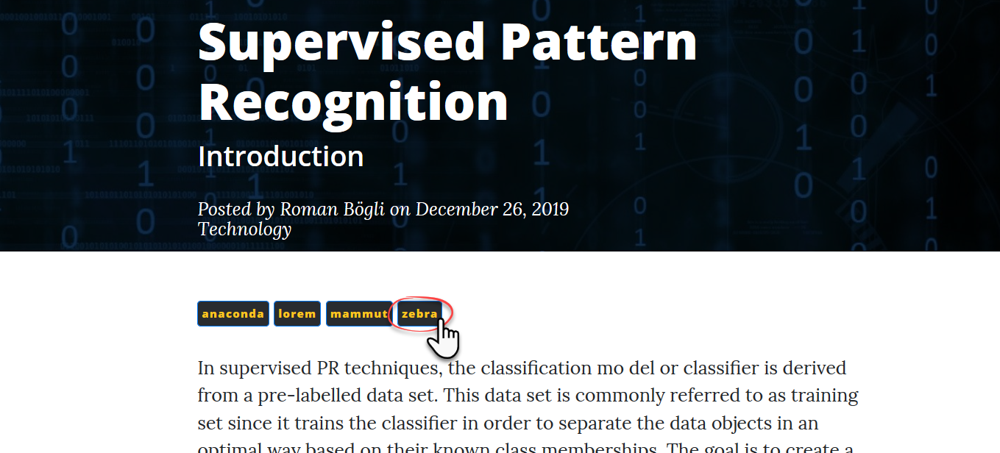
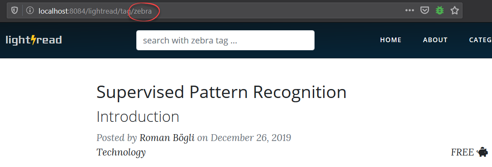

# Router
Lightread uses a special router called [PHRoute](https://github.com/mrjgreen/phroute) which allows simple a routing implementation, modifications, and additional features.

## Groups and Filters
The grouping enables to normalize common actions that must be performed when certain routes are used. The route groups we have are:
- **noauth**: routes that do not require being logged in
- **auth**: routes that do require being logged in
- **authadmin**: routes that do require being logged in as admin

As an example, routes regarding seeing ones profile or changing it are grouped together since they require the user to be logged in.
```php
$router->group(['before' => 'auth'], function($router){
    $router->get('profile', function () {
        UserController::showProfile();
    });
    $router->get('/edit-profile', function () {
        UserController::loadProfile();
    });
    $router->post('/edit-profile', function () {
        UserController::editProfile();
    });
    //and so on ...
});
```
As you can see, there is an _before_ action defined called `auth`. This means that before the actual demanded route is traced,  `auth` is being executed. We defined `auth` in order to redirect the requested route to the login view if the user is not logged in yet. Such filters can also be applied as an _after_ action.
```php
$router->filter('auth', function(){
    if (!AuthController::authenticate()) {
        Router::redirect('/login');
        return false;
    }
});
```


## Reverse Routing
Another handy feature of PHRoute is the reverse routing which allows to introduce dynamic URLs. To illustrate the benefit of this feature, imaging clicking on an article's tag.



The platform will show a list of articles that possess the same tag. The URL of this view incorporates the name of the clicked tag although there exists no explicit route for this since tags are user defined.



Instead, the route has a placeholder `{keyword}` which eventually will be replaced on the fly.

```php
$router->get(['/tag/{keyword}', 'article_keyword'],function ($keyword){
    ContentController::showContentListByKeyword($keyword);
});
```

The tag name `$keyword->getName()` is dynamically incorporated in the buttons `href` during the rendering procedure of the view `post.php`.
```php
<a href="<?php echo $GLOBALS["ROOT_URL"] .'/'. Router::getInstance()->route('article_keyword', [$keyword->getName()]);?>"></a>
```
By means of the reference name `article_keyword`, the tag name is reverse engineered to the existing route `'/tag/{keyword}'`.
