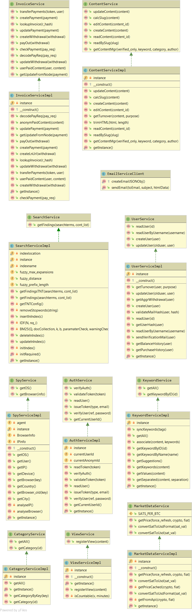

# Services
The business logic is incorporated in different services. This chapter explains each of them.

TODO: should we explain stuff about each individual service? I suggest not.
{: .label .label-red }

## AuthServiceImpl

## CategoryServiceImpl

## ContentServiceImpl

## EmailServiceClient

## InvoiceServiceImpl

## KeywordServiceImpl

## MarketDataServiceImpl

## SearchServiceImpl

## SpyServiceImpl

## UserServiceImpl

## ViewServiceImpl
