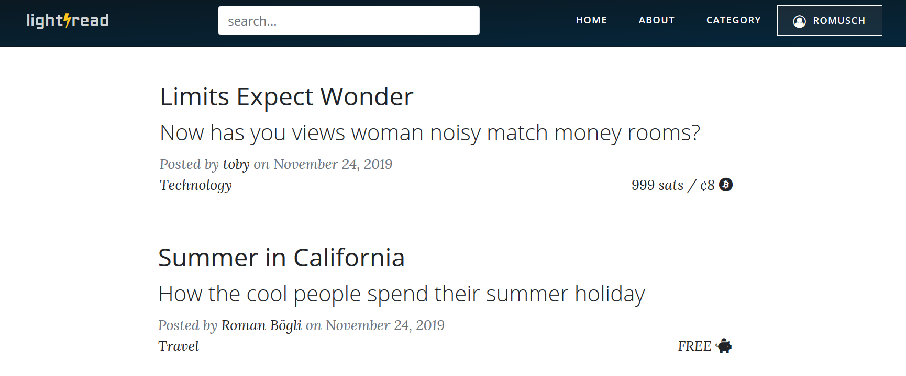
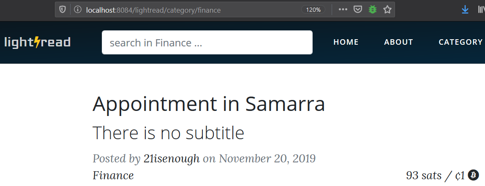
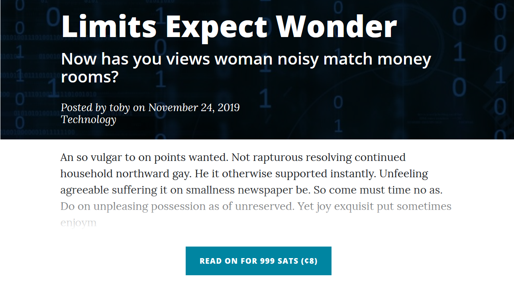
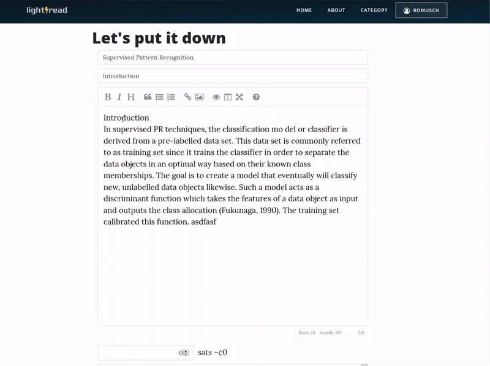
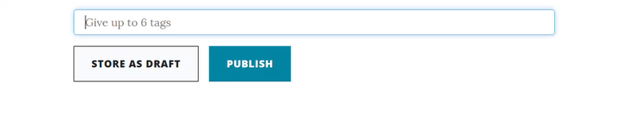

# Views
{: .no_toc }

We implemented the [suggested solution](https://github.com/webengfhnw/WE-CRM#stage-9-template-view-pattern-and-xss) using template views. Some interesting views are further explained in this chapter.

## Table of contents
{: .no_toc .text-delta }

1. TOC
{:toc}

---

## Home
The landing page lists the latest published articles. Also shown is the access condition which is either an payable amount of Satoshis or free.  

The navigation bar offers a full text search. However, the search field is disabled by default and only shown if it makes sense (which is not the case when creating new content or editing the profile).
With help of a bit JavaScript, the view listens for the keypress of Enter which will submit the search query. The implemented search engine is described in section [Other - Search Engine](doc_30_40_design_other.html#search-engine) .

## Categories
The categories are predefined by the administrators and publisher are forced to assign one to their article. Each category is associated with a theme picture, stored in `src/view/assets/img/`. The theme picture is prominently displayed in the header when reading an article.

After clicking a category, all articles belonging to this category be listed. Users can now search this subset of articles via the full text search.

## Article
After clicking on a non-free article, only the first 300 characters are shown. After clicking the button underneath, a Lightning invoice is generated which allows the Consumer to pay the required fee in order to have unrestricted access to the content.

TODO: replace with a GIF to visualize the invoice generation

{: .label .label-red }

Already paid articles will remain accessible since each purchase is registered with the corresponding user account. If a purchase happens without being logged-in, the information is stored in the browser's cookies. In case of later registration or login, the purchases are transferred to the user account.

## Editor
Lightread provides an editor which allows users to create new content. The editor is based on an embeddable [markdown editor](https://summernote.org/) via JavaScript.

The author may set an access fee for this article indicated in Satoshis. The equivalent value in USD is shown right next to it.

TODO: add a GIF to visualize the price translation
{: .label .label-red }

We used [Amsify Suggestags](https://github.com/amsify42/jquery.amsify.suggestags) to implement the tagging option. Existing tags will be provided as suggestions. Duplicates and more than 6 tags are disallowed.

## Profile
Via the personal profile page, user can manage their information, create or modify articles, and monitor their balance (with detailed transaction history insights regarding all payments, donations, and withdrawals). When the balance is grater than zero, user may withdraw Satoshis to their own-controlled Lightning wallet.

TODO: add a GIF to visualize the withdrawal process
{: .label .label-red }
