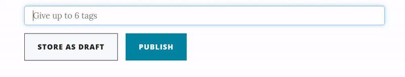

# Views

We implemented the [suggested solution](https://github.com/webengfhnw/WE-CRM#stage-9-template-view-pattern-and-xss) using template views. Some interesting views are further explained in this chapter.

## Editor
The editor belongs to one of the most important components of the web platform. It allows users to create new content by means of embeddable [markdown editor](https://summernote.org/) using JavaScript.

The author may set an access fee for this article indicated in Satoshis. The equivalent value in USD is shown right next to it. The market price is periodically pulled from [CoinMarketCap](https://coinmarketcap.com/api/documentation/v1/) via API. Each requested price is stored in our database with its time stamp. This allows to keep the API call frequency low as only each 5 minutes another call is executed. Otherwise the price in the database is used.

TODO: add a GIF to visualize the price translation
{: .label .label-red }

We used [Amsify Suggestags](https://github.com/amsify42/jquery.amsify.suggestags) to implement the tagging option. Existing tags will be provided as suggestions. Duplicates and more than 6 tags are disallowed.

## Navigation
The navigation bar offers a full text search. However, the search field is disabled by default and only shown if it makes sense (which is not the case when creating new content or editing the profile).

With help of a tiny script, the view listens for the enter keypress resulting in a submit. The implemented search engine is described in section [Services - Search Service](doc_30_20_design_services.html) .
