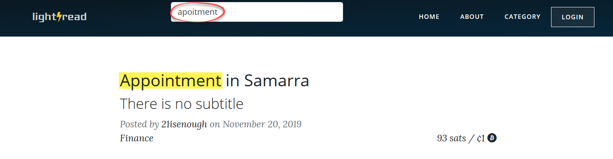
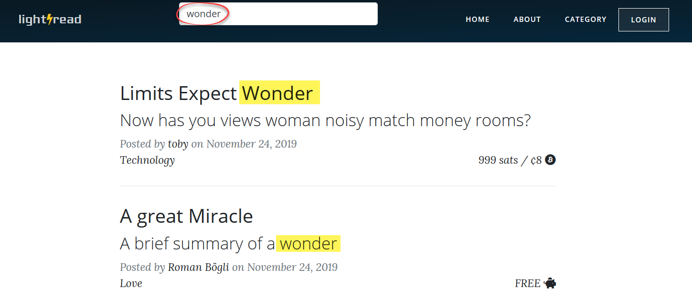

# Other
{: .no_toc }

This chapter documents other important components implemented in lightread.

## Table of contents
{: .no_toc .text-delta }

1. TOC
{:toc}

---


## XSS Prevention

TODO: we did not really prevent this, did we? I suggest not talking about it :-)
{: .label .label-red }

`<?php echo TemplateView::noHTML($customer->getName()) ?>`


## Search Engine
The early version of the search engine was only based on the [BM25](https://github.com/KonstantinosMetallinos/BM25-for-PHP/blob/master/Okapi-BM25.php) matching algorithm. Although we improved this PHP implementation of BM25 using the [Porter Stemmer](https://tartarus.org/martin/PorterStemmer/) and stop word removal, this solution was not satisfying because of two reasons. First, each search request was handled on the fly instead of using predefined search indexes. This resulted in poor performance. Second, minor typos in the search queries could not be managed since only hard matches were possible.
In a later version, we implemented [TNTSearch](https://github.com/teamtnt/tntsearch) which is a powerful full text search component as it indexes all the content and allows fuzzy search.



The information to be searched is passed via a single SQL query. The created index can later be selectively manipulated in case of insertion or manipulation of articles.
```php
private function initIndex(){

    $tnt = new TNTSearch;

    $tnt->loadConfig($this->getTNTConfig());

    $indexer = $tnt->createIndex(self::$indexname);

    $sql = SELECT cont.fld_cont_id as id, REPEAT(CONCAT(cont.fld_cont_title, ' '), 5) as title,  REPEAT(CONCAT(cont.fld_cont_subtitle, ' '), 3) as subtitle, cate.fld_cate_key as category, keyw.keyw_name as keywords, cont.fld_cont_body as body
            FROM tbl_content cont
            LEFT JOIN (SELECT coke.fld_cont_id, string_agg(keyw.fld_keyw_name,  ;   ORDER BY keyw.fld_keyw_name) as keyw_name
                       FROM tbl_keyword keyw INNER JOIN tbl_contentkeyword coke on keyw.fld_keyw_id = coke.fld_keyw_id
                       GROUP BY coke.fld_cont_id) keyw on keyw.fld_cont_id = cont.fld_cont_id
            LEFT JOIN tbl_category cate on cont.fld_cate_id = cate.fld_cate_id;

    $indexer->query($sql);
    $indexer->run();
}
```

Since TNTSearch does not provide any functionality to boost specific query fields, the more important field are repeated more often than less important ones. In the case of lightread, `title` has a weight of 5, `subtitle` 3, and the rest 1.



The articles are extracted out of the database with help of the `ContentServiceImpl`. The function `getContentMgr` accepts tags, categories, or authors as input parameters which are used to filter set of articles correspondingly. The function's return value is an object of `ConentManager` which holds the article set. If a search query was posted, this set of articles may be further reduced using `SearchServiceImpl`.

```php
public static function showContentList()
{
    $navigation = new TemplateView('navigation.php');
    $navigation->allowSearch = true;
    $navigation->SearchPlaceholder = "search...";
    $home = new TemplateView("home.php");
    $mgr = ContentServiceImpl::getInstance()->getContentMgr(true);
    if(isset($_POST["searchterm"])){
        $findings = SearchServiceImpl::getInstance()->getFindingsTNT($_POST["searchterm"], $mgr->getContent());
        $mgr->updateContentList($findings);
    }
    $home->mgr=$mgr;
    LayoutRendering::simpleLayout($home, $navigation);
}
```

This technique allows to search a subset of articles, for instance a clicket tag, category, or author.


## Email Verification
Lightread sends emails to users because of two reasons. One is the user verification which is mandatory in order to publish content. The other is the possibility to reset the password. The emails are sent via [SendGrid](https://sendgrid.com/docs/).


## Tokenization
Tokens are issues either when an user logs in or someone pays an invoice without being logged in (anonymous user). A token objects holds a hash value, a selector, a type, and an expiration.

```php
public function issueToken(AuthType $type, $email = null) {
    $token = new AuthToken();
    $validator = random_bytes(20);
    $token->setValidator(hash('sha256', $validator));
    $token->setSelector(bin2hex(random_bytes(5)));
    $token->setType($type);

    if($type == AuthType::USER_TOKEN()){
        $token->setUser($this->readUser());
        $timestamp = (new \DateTime('now'))->modify('+30 days');
    }elseif($type == AuthType::ANONYM_TOKEN()){
        $timestamp = (new \DateTime('now'))->modify('+365 days');
    }elseif ($type == AuthType::RESET_TOKEN()){
        $token->setUser((new UserDAO())->findByEmail($email));
        $timestamp = (new \DateTime('now'))->modify('+1 hour');
    }
    $token->setExpiration($timestamp);
    $authTokenDAO = new AuthTokenDAO();
    $authTokenDAO->create($token);
    return $token->getSelector() .":". bin2hex($validator);
}
```

TODO: Should this sections be extended?
{: .label .label-red }


## jQuery Polling
After an lightning invoice was generated, the connected Lightning node must inform lightread about its status. This polling starts right after the invoice is displayed to the user repeats as long as this page is shown. Using jQuery, a `POST` with the corresponding invoice reference (pay_req) is sent to the route `checkinvoice`.


TODO: add a GIF showing how lightning fast Lightning is :-)
{: .label .label-red }


```php
// start
(function poll(){
    setTimeout(function(){
        var pay_req = $('#response').val();
        $('#paid').text("start polling...");
        $.ajax({
            type: 'POST',
            url: '<?php  echo $GLOBALS["ROOT_URL"]; ?>/checkinvoice',
            data: {ajax: 1,pay_req: pay_req},
            dataType: "json",
            success: function(response){
                $('#paid').text(response.text);
                if (response.paid){
                    callback(); //inform about success
                }else {
                    poll(); //check again...
                }
            }
        });
    }, 1000);
});
```


For each `POST` to `\checkinvoice`, the `InvoiceController` enquires the latest status of the invoice reference from the Lightning node. After the invoice is deemed as paid, the client side polling will stop by following a callback function. In case of a purchase, the page is reload to give full access. In case of a donation, a banner is shown expressing thanks to the donor.  

```php
public static function checkInvoice()
{
    if( isset($_POST['ajax']) && isset($_POST['pay_req']) ){
        $inv_svc = InvoiceServiceImpl::getInstance();

        if($inv_svc->checkPayment($_POST["pay_req"])){
            $response->paid= true;
            $response->text= "Status: payment successful";
        }
        else{
            $response->paid= false;
            $response->text= "Status: unpaid";
        }

        $json_response = json_encode($response);
        echo $json_response;
        exit;
    }
}
```

## Views Registration
When a content is shown, lighread registers a view. This data can later be used to inform user about their content's popularity or to optimize the search engine. Ideally, the viewer is logged in which allows unique identification. Otherwise, the viewer is identified by its combination of IP address, operating system, device type, and browser type. To avoid falsification in this data, recurring content views of the viewers is tried to be suppressed using a timeout of 20 minutes.

TODO: show screenshot of tbl_views
{: .label .label-red }
