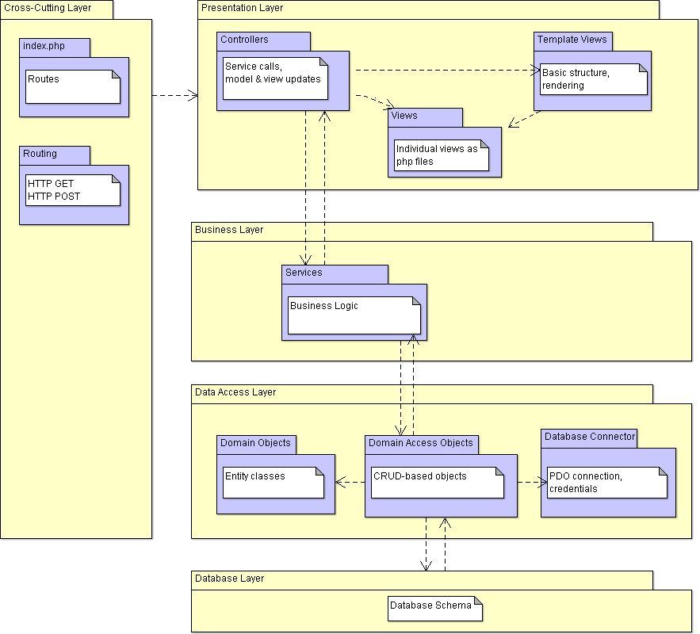
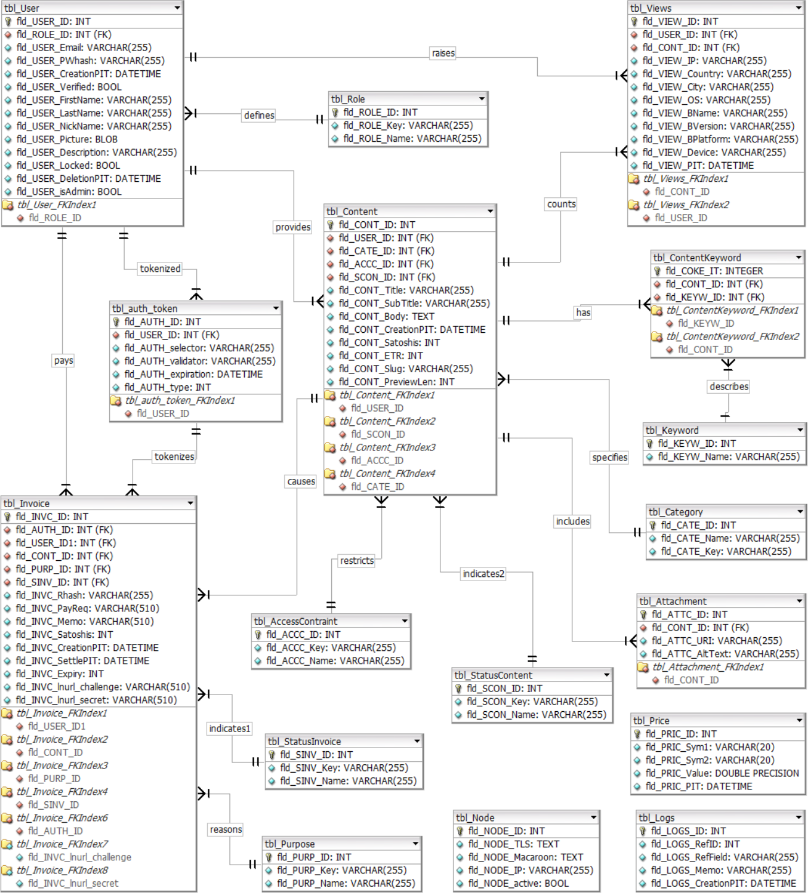
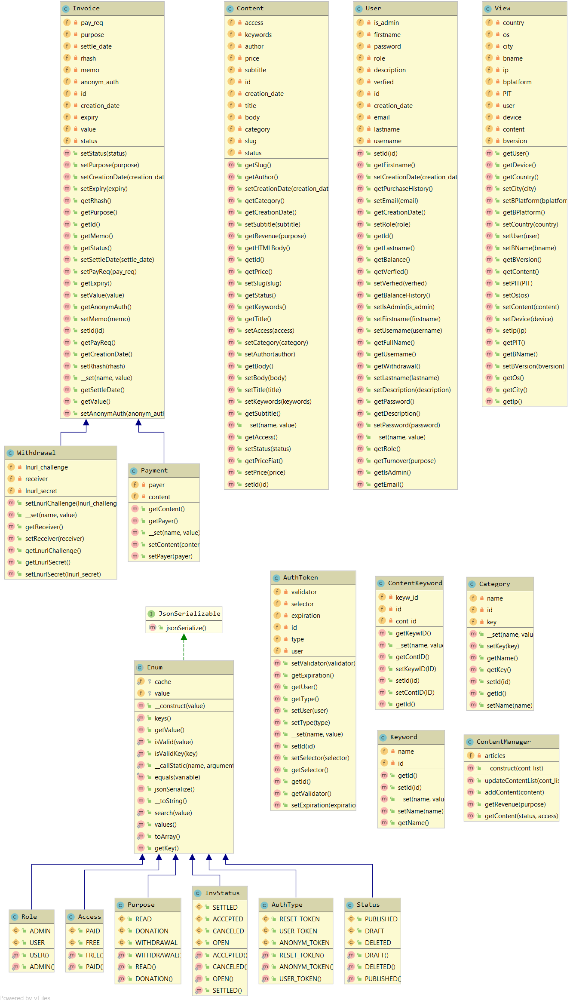
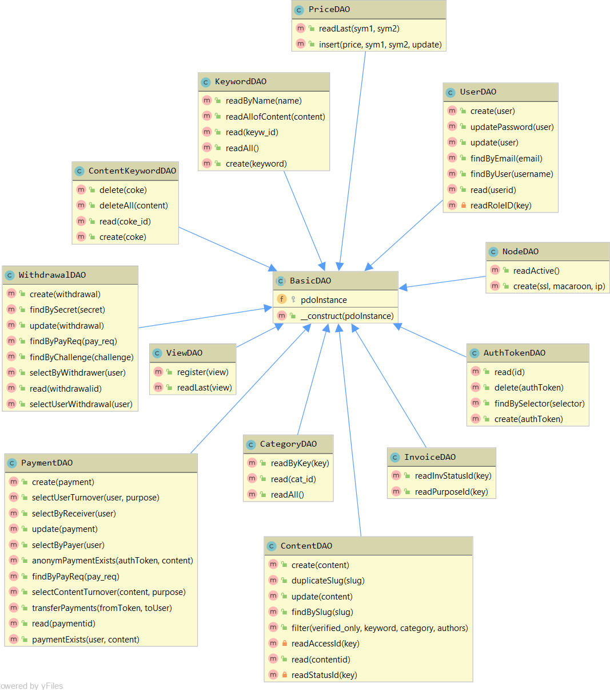
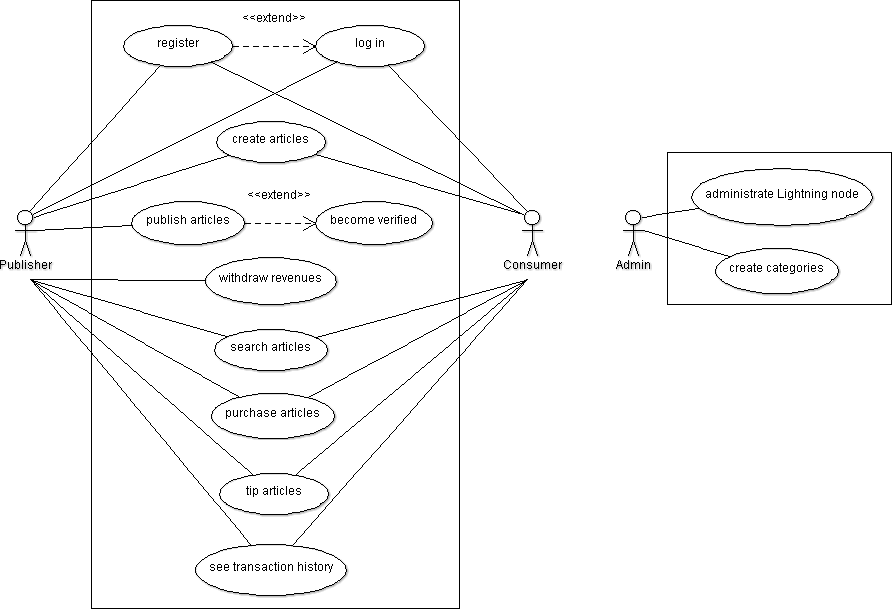

# Architecture and Design
{: .no_toc }

This chapter provides insights in the programming concept of lightread.

## Table of contents
{: .no_toc .text-delta }

1. TOC
{:toc}

---

## ERD

## Class Diagram / Domain Model

## Data Access Objects (DAO)

## Use Case Diagrams

