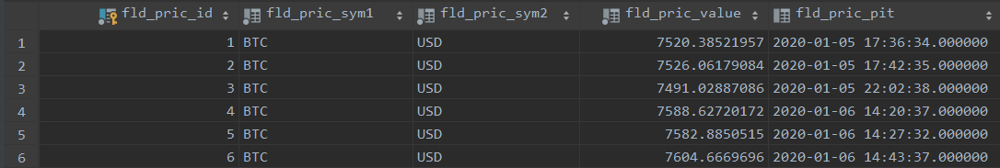

# External services used
{: .no_toc }

## Table of contents
{: .no_toc .text-delta }

1. TOC
{:toc}

---

## Price data
The market price is periodically polled from [CoinMarketCap](https://coinmarketcap.com/api/documentation/v1/) via API. Each requested price is stored in our database with its time stamp. This allows to keep the API call frequency low since the next call is only execute if the previous one is older than a given tolerance in minutes (currently 15 minutes). If that time span has not yet elapsed, the cached price from the database is used. The architecture allows to store every currency pair but at the moment only BTC/USD is implemented.

## Email Verification
Lightread sends emails to users because of two reasons. One is the user verification which is mandatory in order to publish content. The other is the possibility to reset the password. The emails are sent via [SendGrid](https://sendgrid.com/docs/).
